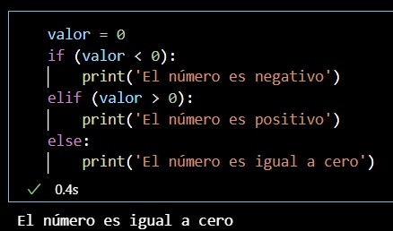
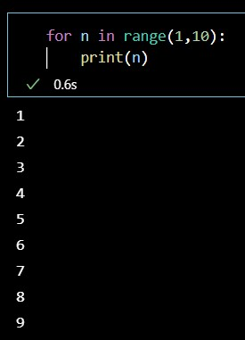
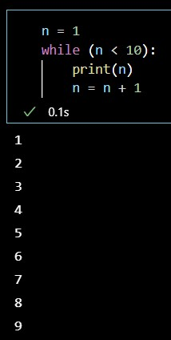

# Introducción a la Programación

## ¿Qué es la Programación?

En la imagen, se representa un pequeño robot abeja en una esquina del cuadrilátero, y en la otra una flor. El objetivo del robot abeja es llegar hasta la flor, esquivando los arbustos que hay de por medio. Para esto, hay que decirle cómo se debe mover, pero puede saltar de a un casillero por vez y la forma en que se le puede "decir" es a travez de instrucciones. Esas instrucciones son "arriba", "abajo", "izquierda" y "derecha". Y por supuesto, teniendo en cuenta que debe moverse dentro del cuadrilátero.

Ahora bien, surgen algunas preguntas:

* ¿Cuántas instrucciones son necesarias?

* Al ser más de una instrucción ¿Es importante el orden en que se ejecutan?

* ¿Hay más de una forma, en que el robot abeja pueda llegar a la flor?

* ¿Hay un camino más óptimo?

* ¿Cómo puedo medir si un camino es más óptimo que otro?


Cualquiera de las siguiente, podrían ser una solución:
* Derecha, Derecha, Arriba, Arriba, Derecha, Derecha, Arriba, Arriba, Arriba, Derecha, Derecha, Arriba
* Derecha, Derecha, Derecha, Derecha, Derecha, Derecha, Arriba, Arriba, Arriba, Izquierda, Izquierda, Arriba, Arriba, Derecha, Arriba, Derecha
* Arriba, Derecha, Derecha, Arriba, Arriba, Arriba, Arriba, Arriba, Derecha, Derecha, Derecha, Derecha, Arriba

Lo importante, en principio, es que notemos que al resolver el problema planteado, lo que estamos haciendo, utilizando un pensamiento lógico, es precisamente, <b>programación</b>

Entonces, <b>programar, es armar una secuencia lógica de pasos a seguir, en pos de cumplir un objetivo.</b> En el ejemplo visto, tuvimos un contexto que nos marcaba las posibilidades y restricciones del problema, por ejemplo moverse dentro del cuadrílatero ó no chocar con los arbustos. Y también un conjunto de instrucciones disponibles, que definian el lenguaje que teníamos que usar, para que el robot comprenda las instrucciones. Lo que usamos fue un lenguaje formal, muy básico y que fue suficiente para resolver el problema. Éstos lenguajes, se denominan lenguajes de programación, nos permiten plasmar esas instrucciones necesarias para darle una solución al problema que queremos resolver, generando así un programa (ó software).

Los primeros lenguajes de programación se escribían en instrucciones que podían interpretar las computadores muy facilmente, pero que resultaban menos amigables a las personas, tales como el lenguaje ensamblador (o Assembler) o Fortran, desarrollado en 1955. Con el tiempo, esto fue cambiando, se fueron desarrolando lenguajes de programación de más alto nivel y con diferentes aplicaciones, que por lo general eran comerciales o científicas, pero tambien con fines educativos, es decir, lenguajes desarrollados para aprender a programar, y consecuentemente, también sea más sencillo. 

Éste último, es el caso de <b>Python</b>, que nace a finales de la década del 80, fue pensado para principiantes por su facilidad de aprendizaje y uso. Su código era compacto pero legible. Con el correr de los años fue incluyendo mejoras hasta llegar tambien a ser de licencia libre. Hoy por hoy, es usado desde en simples "scripts", hasta grandes servidores web que proveen servicio ininterrumpido las 24hs. Es utilizado para la programación de interfaces gráficas y bases de datos. Además tiene una amplia aceptación por científicos que hacen aplicaciones para las supercomputadores más rápidas del mundo y por los niños que recién están comenzando a programar.

## Sintaxis

Para el ejemplo se uso un lenguaje con el que era posible determinar los pasos a seguir por el robot abeja hasta llegar a la flor, y nos fue suficiente para poder entender como resolveríamos el problema. El hecho es que, los lenguajes de programación que utilizamos, deben ser más específicos todavía, necesitamos tener un nivel de detalle mayor en nuestras instrucciones, por ejemplo, en lugar de la instruccion "Arriba", podría ser, especificar la cantidad de celdas que hay que moverse, e incluso qué implica "moverse", que seguramente será cambiar el estado de la propia abeja. 
Por otro lado tambien habrá un marco de referencia, es decir, el tablero donde se mueve la abeja y está la flor, en sí mismo, es algo que debemos conocer, saber donde hay ubicado un arbusto y donde no, saber cuales son los límites, y que pasa si con las instrucciones que le damos a la abeja, hacemos que rebase esos límites.
Para solventar esa complejidad, necesitamos un <b>set de instrucciones</b> un poco más complejo para poder interactuar con el computador una forma de representar los datos de la realidad, es decir, dimensiones del tablero donde se mueve la abeja, posición de la abeja, posición de la flor, ubicaciones de los arbustos, y todo esto se hace mediante lo que se conoce como <b>estructuras</b> de datos, las cuales permiten entonces representar la realidad. De hecho, todos </b>los datos son una representación de la realidad</b>.
La sintaxis de un programa, consiste en un conjunto de palabras reservadas a instrucciones, con una estructura específica, tal y como funciona un lenguaje como el que usamos los humanos para comunicarnos, como el español o el inglés. Los lenguajes de programación tambien tienen su sintaxis, que esta compuesta por diferentes elementos, como ser variables para representar el dato de la realidad, sentencias para representar las instrucciones ó estructuras de control que conforman el cuerpo del programa.

## Variables

Una variable es un espacio de memoria donde guardamos un dato, ese espacio de memoria a la vez recibe un nombre:


Y esto conforma la estructura de datos más simple que podemos encontrar.

## Tipos de Datos

Es importante notar, que podemos encontrarnos con datos de tipos distintos, es decir numéricos, alfanuméricos, fechas o booleanos.

En Python tenemos los siguientes:
 * Enteros: El conjunto de números naturales
 * Floats: El conjunto de números reales o de punto flotante
 * Strings: Es texto, caracteres alfanuméricos que se introducen entre comillas dobles o simples
 * Booleanos: Representan Verdadero ó Falso
 * Complejos: El conjunto de números complejos

Todo valor que pueda ser asignado a una variable tiene asociado un tipo de dato y esto establece qué operaciones se pueden realizar sobre la misma.

## Operaciones entre Variables

Con diferentes tipos de datos podemos hacer diferentes tipos de operaciones. Y hay operaciones no permitidas entre variables de diferentes tipos de datos:

Tipos de datos numéricos:

| Operacion | Operador | Ejemplo |
| :---      |  :----:  |    ---: |
| Suma      | + | 3 + 5.5 = 8.5 |
| Resta   | -  | 4 - 1 = 3  |
| Multiplicación | -  | 4 - 1 = 3  |
| Potencia | -  | 4 - 1 = 3  |
| División (Cociente) | -  | 4 - 1 = 3  |
| División (parte entera) | -  | 4 - 1 = 3  |
| División (resto) | -  | 4 - 1 = 3  |

Cuando tratamos con texto, podemos hacer otras operaciones:

| Operacion | Operador | Ejemplo |
| :---      |  :----:  |    ---: |
| Concatenar | + | 'hola ' + 'mundo !' = 'hola mundo!' |
| Multiplicar | * | 'ja ' + 3 = 'ja ja ja' |

Algunos ejemplos en Python:


Notar que en la operaciones que no están permitidas arroja un error, que es muy descriptivo. En este caso no es posible sumar un valor entero con un valor alfanumérico.


Operaciones Lógicas

Son operaciones en las que entran en uso el tipo de datos booleano, es decir, que nos permiten representar valores verdadero ó falso. Para verlo mejor, es necesario recurrir a lo que llamamos tablas de verdad.
Veremos muy comunmente representar verdadero con un "1" y falso con un "0".

Tabla del operador lógico "and", se verifican que A y B sean verdaderas.  
| A | B | A and B |
| :- | :--: | -: |
| 1 | 0 | 0 |
| 0 | 0 | 0 |
| 0 | 1 | 0 |
| 1 | 1 | 1 |

Tabla del operador lógico "or", se verifican que A ó B sean verdaderas. 
| A | B | A or B |
| :- | :--: | -: |
| 1 | 0 | 1 |
| 0 | 0 | 0 |
| 0 | 1 | 1 |
| 1 | 1 | 1 |

Tambien es posible representar la negación, con el operador not()

Tabla del operador lógico "Or Exclusiva", se verifica ((A and not(B)) or (not(A) and B))
| A | B | A "or exclusiva" B |
| :- | :--: | -: |
| 1 | 0 | 1 |
| 0 | 0 | 0 |
| 0 | 1 | 1 |
| 1 | 1 | 0 |

## Flujos de Control

### Condicionales

Los condicionales son bloques de código que se ejecutan únicamente si se cumple una condición. 
El resultado de esta condición debe ser booleano (True o False).
Esto se logra mediante la sentencia <b>if</b>.
Con la sentencia <b>elif</b> se puede agregar un número arbitrario de condiciones. 
Por otra parte, se puede ejecutar código si la/s condición/es no se cumple/n con la sentencia <b>else</b>.



### Ciclos Iterativos o Loops

Son bloques de código que se repiten una cierta cantidad de veces en función de ciertas condiciones.

Un ciclo <b>for</b> repite un bloque de código tantas veces como elementos haya dentro del rango entre 1 y 10:



Un ciclo <b>while</b> repite un bloque de código mientras que cierta condición se cumpla:



### Consideraciones

Hemos llegado hasta este punto y se repasaron algunos de los conceptos más fundamentales de la programación y también de Python, pero es necesario detenerse en algunos detalles, que tienen que ver precisamente con el lenguaje que estamos utilizando:

* En Python es importante la indentación, notar que el codigo que se ejecuta dentro de una sentencia if, for o while está indentado.
* Tambien es importante notar los ":"
* En Python hay algunas funcionalidades ya presentes por defecto, como por ejemplo la funcion print() que permite mostrar una salida por pantalla y la función range() que devuelve un rango numérico según los parámetros que recibe y con la función type() es posible ver el tipo de dato de una variable
* En Python, cada vez que hagamos referencia a un rango, por ejemplo "1,10" el primer numero se incluye y el último no.

## Estructuras de datos

Anteriormente se menciono que un dato representa la realidad, y se presento el concepto de variable, que es un elemento que nos permite guardar un dato dentro de nuestro programa. Sin embargo, rápidamente vamos a llegar a la conclusión de que una variable puede llegar a quedar insuficiente para ciertas representaciones. Ante esta situación, en los lenguajes de programación tenemos estructuras de datos más complejas, en el caso de Python contamos con listas, tuplas y diccionarios.

### Listas

Una estructura de dato muy importante en Python es la lista, que consiste en una serie de elementos ordenados.
Esos elementos pueden ser de distinto tipo, e incluso pueden ser de tipo lista también:
Operaciones con listas:
* Creacion -> mi_lista = ['Rojo','Azul','Amarillo','Naranja','Violeta','Verde']
* Imprimir -> print(mi_lista)
* Ver el tipo de dato -> type(mi_lista)


```python
``` 