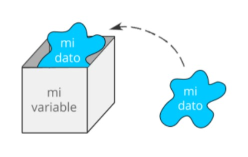

<!--# ANALYTICS:-->
<!-- Google tag (gtag.js) -->
<script async src="https://www.googletagmanager.com/gtag/js?id=UA-161500899-3">
</script>
<script>
  window.dataLayer = window.dataLayer || [];
  function gtag(){dataLayer.push(arguments);}
  gtag('js', new Date());
  gtag('config', 'UA-161500899-3');
</script>

<!--# GOOGLE TAG MANAGER-->
<!--# HEAD-->
<!-- Google Tag Manager -->
<script>
  (function(w,d,s,l,i){w[l]=w[l]||[];w[l].push({'gtm.start':
  new Date().getTime(),event:'gtm.js'});var f=d.getElementsByTagName(s)[0],
  j=d.createElement(s),dl=l!='dataLayer'?'&l='+l:'';j.async=true;j.src=
  'https://www.googletagmanager.com/gtm.js?id='+i+dl;f.parentNode.insertBefore(j,f);
  })(window,document,'script','dataLayer','GTM-5Z2JFWV');
</script>
<!-- End Google Tag Manager -->
<!--# BODY-->
<!-- Google Tag Manager (noscript) -->
<noscript>
  <iframe src="https://www.googletagmanager.com/ns.html?id=GTM-5Z2JFWV"
height="0" width="0" style="display:none;visibility:hidden">
  </iframe>
</noscript>
<!-- End Google Tag Manager (noscript) -->
<!-- Google tag (gtag.js) -->
<script async src="https://www.googletagmanager.com/gtag/js?id=G-LHV5X0V6Y9"><script>
<script>
  window.dataLayer = window.dataLayer || [];
  function gtag(){dataLayer.push(arguments);}
  gtag('js', new Date());
  gtag('config', 'G-LHV5X0V6Y9');
</script>

## Grabación de la Clase 2 

<!--div class="iframeContainer">
  <iframe src="https://player.vimeo.com/video/674888247" allow="autoplay; fullscreen" allowfullscreen></iframe>
</div-->
<div class="iframeContainer">
  <iframe src="https://player.vimeo.com/video/674888247?h=99f9e6c3f6" allow="autoplay; fullscreen" allowfullscreen></iframe>
</div>

## Principales Objetivos de Aprendizaje para esta Clase

- Conocer el concepto de Variables y Constantes
- Conocer el concepto de Tipos de Datos


## Variables

Una variable es un espacio de memoria donde guardamos un dato, ese espacio de memoria a la vez recibe un nombre y esto conforma la estructura de datos más simple que podemos encontrar.



Por otro lado existen ciertas normas a la hora de nombrar variables:

* El nombre no puede empezar con un número<br>
  Por ejemplo "mi_variable" sería correcto, pero "123mi_variable" sería erróneo 
* No se permite el uso de guiones del medio -<br>
  Por ejemplo "mi-variable" sería erróneo
* No se permite el uso de espacios.<br>
  Por ejemplo "mi variable" sería erróneo
* No usar nombres reservados para Python. Las palabras reservadas son utilizadas por Python internamente, por lo que no podemos usarlas para nuestras variables o funciones.<br>
  Por ejemplo, a veces podríamos usar "int" ó "for" y esto nos daría error, porque como se verá más adelante, esas palabras son parte de la sintaxis de Python.

### Constantes

Sin embargo, cuando ese dato no lo alojamos en una variable y lo utilizamos directamente, recibe el nombre de constante.

### Tipos de Datos

Es importante notar, que podemos encontrarnos con datos de tipos distintos, es decir numéricos, alfanuméricos o booleanos.

En Python tenemos los siguientes:
 * Enteros: el conjunto de números enteros
 * Floats: el conjunto de números reales o de punto flotante
 * Cadenas o Strings: es texto, caracteres alfanuméricos que se introducen entre comillas dobles o simples
 * Booleanos: representan Verdadero ó Falso
 * Complejos: el conjunto de números complejos

Todo valor que pueda ser asignado a una variable tiene asociado un tipo de dato y esto establece qué operaciones se pueden realizar sobre la misma.

<hr width="75%">
  <p align="center">
  Tip: En Python hay algunas funcionalidades ya presentes por defecto, como por ejemplo la funcion **print()** que permite mostrar una salida por pantalla y la función range() que devuelve un rango numérico según los parámetros que recibe y con la función **type()** es posible ver el tipo de dato de una variable
  </p>
<hr width="75%">

### Operaciones entre Variables

Con diferentes tipos de datos podemos hacer diferentes tipos de operaciones. Y hay operaciones no permitidas entre variables de diferentes tipos de datos.

**Operaciones aritméticas:**

| Operación | Operador | Ejemplo |
| :---      |  :----:  |    ---: |
| Suma      | + | 3 + 5.5 = 8.5 |
| Resta   | -  | 4 - 1 = 3  |
| Multiplicación | *  | 4 * 2 = 8  |
| Potenciación | 4<sup>2</sup>  | 4**2 = 16  |
| División (Cociente) | /  | 4 / 2 = 2  |
| División (parte entera) | //  | 14 // 3 = 4  |
| División (resto) | %  | 14 % 3 =  2 |

**Operadores relacionales:**

| Operación | Operador | Ejemplo |
| :---      |  :----:  |    ---: |
| == | Igual | 10 == 3 = False |
| != | Distinto | 10 != 3 = True |
| >	| Mayor	| 10 > 3 = True |
| < | Menor	| 10 < 3 = False |
| >= | Mayor o igual | 10 >= 3 = True |
| <= | Menor o igual | 10 <= 3 = False |

**Operaciones de asignación:**

| Operación | Operador | Ejemplo |
| :---      |  :----:  |    ---: |
| =   | x=7  | x=7  |
| +=  | x+=2  | x=x+2 = 9  |
| -=  | x-=2  | x=x-2 = 5  |
| *=  | x*=2  | x=x*2 = 14  |
| /=  | x/=2  | x=x/2 = 3.5  |
| %=  | x%=2  | x=x%2 = 1  |
| //=  | x//=2  | x=x//2 = 3  |
| **=  | x**=2  | x=x**2 = 49  |
| &=  | x&=2  | x=x&2 = 2  |
| ^=  | x^=2  | x=x^2 = 5  |
| >>=  | x>>=2  | x=x>>2 = 1  |
| <<= | x<<=2 | x=x<<=2 = 28  |


Operación: |=   <br>
Operador: x|=2  <br>
Ejemplo: x=x|2 = 7  <br>

Cuando tratamos con texto, podemos hacer otras operaciones:

| Operación | Operador | Ejemplo |
| :---      |  :----:  |    ---: |
| Concatenar | + | 'hola ' + 'mundo !' = 'hola mundo!' |
| Multiplicar | * | 'ja ' * 3 = 'ja ja ja' |

Algunos ejemplos en Python:

```python
>>> a = 'Hola '
>>> b = 'Mundo !'
>>> print(a + b)
Hola Mundo !

>>> x = 3
>>> y = 12
>>> print(x + y)
15

>>> print(a + x)
---------------------------------------------------------------------------
TypeError                                 Traceback (most recent call last)
~\AppData\Local\Temp/ipykernel_18232/136165486.py in <module>
----> 1 print(a + x)

TypeError: can only concatenate str (not "int") to str
```

Notar que en las operaciones que no están permitidas arroja un error, que es muy descriptivo. En este caso no es posible sumar un valor entero con un valor alfanumérico.

```python
>>> # Dividir "y" entre "x"
>>> y = 9
>>> x = 3
>>> print(y/x)
3.0

>>> # Potencia de "y" elevado a la "x"
>>> y = 2
>>> x = 4
>>> print(y**x)
16

>>> # Devolver el resto de la división
>>> y = 13
>>> x = 3
>>> print(y%x)
1

>>> # Imprimir el tipo de dato de una variable y una constante
>>> y = 2.5
>>> type(y)
float
>>> type(2.5)
float
```

Notar que anteponiendo el carácter numeral (#) es posible agregar comentarios en el código. Por otra parte, la función **type()** es muy útil para saber a qué tipo de dato corresponde un elemento.

**Operaciones Lógicas**

Son operaciones en las que entran en uso el tipo de datos booleano, es decir, que nos permiten representar valores verdadero o falso. Para verlo mejor, es necesario recurrir a lo que llamamos tablas de verdad.
Veremos muy comúnmente representar verdadero con un "1" y falso con un "0".

Tabla del operador lógico "and", se verifican que A y B sean verdaderas.  
| A | B | A and B |
| :- | :--: | -: |
| 1 | 0 | 0 |
| 0 | 0 | 0 |
| 0 | 1 | 0 |
| 1 | 1 | 1 |

Tabla del operador lógico "or", se verifican que A o B sean verdaderas. 
| A | B | A or B |
| :- | :--: | -: |
| 1 | 0 | 1 |
| 0 | 0 | 0 |
| 0 | 1 | 1 |
| 1 | 1 | 1 |

Tambien es posible representar la negación, con el operador not()

Tabla del operador lógico "Or Exclusiva", se verifica ((A and not(B)) or (not(A) and B))
| A | B | A "or exclusiva" B |
| :- | :--: | -: |
| 1 | 0 | 1 |
| 0 | 0 | 0 |
| 0 | 1 | 1 |
| 1 | 1 | 0 |

```python
>>> a = True
>>> b = False
>>> print(a or b)
True
```

<hr width="75%">
  <p align="center">
  Tips: Notar que las constantes "True" y "False" se escriben con la primer letra mayúscula y el resto minúsculas, de otra forma arrojaría un error
  </p>
<hr width="75%">

### Conversión de tipos de datos

Puede haber ocasiones en las que desee especificar un tipo en una variable. Esto se puede hacer con lo que se denomina **casting**. 
La conversión de tipo de dato en python se realiza mediante funciones:

int(): construye un número entero a partir de un literal entero, un literal flotante (eliminando todos los decimales) o un literal de cadena (siempre que la cadena represente un número entero)
float(): construye un número flotante a partir de un literal entero, un literal flotante o un literal de cadena (siempre que la cadena represente un flotante o un entero)
str(): construye una cadena a partir de una amplia variedad de tipos de datos, incluidas cadenas, literales enteros y literales flotantes

```python
>>> x = '2'
>>> print(type(x))
<class 'str'>
>>> x = int(x)
>>> print(type(x))
<class 'int'>
>>> y = int(2.8)
>>> print(y)
2
```

## Homework

Completa la tarea descrita en el archivo [README](https://github.com/soyHenry/Python-Prep/blob/4aec1885136fdcff98899d2be13c8908b39f8b21/02%20-%20Variables%20y%20Tipos%20de%20Datos/Prep_Course_Homework_02.md)

Si tienes dudas sobre este tema, puedes consultarlas en el canal #python de Slack

<table class="hide" width="100%" style='table-layout:fixed;'>
  <tr>
    <td>
      <a href="https://airtable.com/shrSzEYT4idEFGB8d?prefill_clase=00-PrimerosPasos">
        
        <br>
        Hacé click acá para dejar tu feedback sobre esta clase.
      </a>
    </td>
  </tr>
</table>
