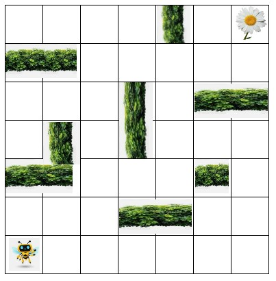

# Introducción a la Programación

## ¿Qué es la Programación?

Comencemos con un ejemplo, en la imagen se representa un pequeño robot abeja en una esquina del cuadrilátero, y en la otra esquina una flor. El objetivo del robot abeja es llegar hasta la flor, esquivando los arbustos que hay de por medio. Para esto, hay que decirle cómo se debe mover, pero solo puede saltar de a un casillero por vez. La forma en que se le puede "decir" es a través de instrucciones y estas son: "arriba", "abajo", "izquierda" y "derecha". Por supuesto, teniendo en cuenta que debe moverse dentro del cuadrilátero.

Ahora bien, surgen algunas preguntas:

* ¿Cuántas instrucciones son necesarias?

* Al ser más de una instrucción ¿Es importante el orden en que se ejecutan?

* ¿Hay más de una forma en que el robot abeja pueda llegar a la flor?

* ¿Hay un camino óptimo?

* ¿Cómo puedo medir si un camino es el óptimo con respecto a otros caminos?

Cualquiera de las siguientes, podrían ser una solución:
* Derecha, Derecha, Arriba, Arriba, Derecha, Derecha, Arriba, Arriba, Arriba, Derecha, Derecha, Arriba
* Derecha, Derecha, Derecha, Derecha, Derecha, Derecha, Arriba, Arriba, Arriba, Izquierda, Izquierda, Arriba, Arriba, Derecha, Arriba, Derecha
* Arriba, Derecha, Derecha, Arriba, Arriba, Arriba, Arriba, Arriba, Derecha, Derecha, Derecha, Derecha, Arriba

Lo importante, en principio, es que notemos que al resolver el problema planteado, lo que estamos haciendo, utilizando un pensamiento lógico, es precisamente, **programación**

Entonces, **programar, es armar una secuencia lógica de pasos a seguir, en pos de cumplir un objetivo.** En el ejemplo visto, tuvimos un contexto que nos marcaba las posibilidades y restricciones del problema, por ejemplo moverse dentro del cuadrilátero o no chocar con los arbustos. Y también un conjunto de instrucciones disponibles, que definían el lenguaje que teníamos que usar, para que el robot comprenda las instrucciones. Lo que usamos fue un lenguaje formal, muy básico y que fue suficiente para resolver el problema. Estos lenguajes, se denominan lenguajes de programación, nos permiten plasmar esas instrucciones necesarias para darle una solución al problema que queremos resolver, generando así un programa (o software).

Los primeros lenguajes de programación se escribían en instrucciones que podían interpretar las computadoras muy fácilmente, pero que resultaban menos amigables a las personas, tales como el lenguaje ensamblador (o Assembler) o Fortran, desarrollado en 1955. Con el tiempo, esto fue cambiando, se fueron desarrollando lenguajes de programación de más alto nivel y con diferentes aplicaciones, que por lo general eran comerciales o científicas, pero también con fines educativos, es decir, lenguajes desarrollados para aprender a programar, y consecuentemente, más sencillos. 

Éste último, es el caso de **Python**, que nace a finales de la década del 80 y fue pensado para principiantes por su facilidad de aprendizaje y uso. Su código era compacto pero legible. Con el correr de los años fue incluyendo mejoras hasta llegar también a ser de licencia libre. Hoy por hoy, es usado desde simples "scripts", hasta grandes servidores web que proveen servicio ininterrumpido las 24hs. Es utilizado para la programación de interfaces gráficas y bases de datos. Además tiene una amplia aceptación por científicos que hacen aplicaciones para las supercomputadoras más rápidas del mundo y por los niños que recién están comenzando a programar.
La generalización del Big Data en los últimos años, seguida de la explosión de la Inteligencia Artificial, Machine Learning y el surgimiento de la Ciencia de Datos como una nueva área de trabajo con especialistas propios, ha revolucionado el panorama ya que muchas de las nuevas herramientas que han surgido han sido desarrolladas en Python o nos ofrecen Python como la forma predilecta de interactuar con ellas.
Podemos hablar de tecnología para Big Data como PySpark, de herramientas para Data Science como Pandas, NumPy, Matplotlib o Jupyter. De herramientas del procesamiento del lenguaje natural como NLTK, y por último el área de Deep Learning como Tensorflow, MXNet o Scikit-Learn.

## Sintaxis de un lenguaje de programación

Para el ejemplo se utilizó un lenguaje con el que era posible determinar los pasos a seguir por el robot abeja hasta llegar a la flor, y nos fue suficiente para poder entender cómo resolver el problema. El hecho es que, los lenguajes de programación que utilizamos, deben ser más específicos todavía, necesitamos tener un nivel de detalle mayor en nuestras instrucciones, por ejemplo, en lugar de la instrucción "Arriba", podría ser, especificar la cantidad de celdas que hay que moverse, e incluso qué implica "moverse", que seguramente será cambiar el estado de la propia abeja. 
Por otro lado también habrá un marco de referencia, es decir, el tablero donde se mueve la abeja y está la flor, en sí mismo, es algo que debemos conocer, saber donde hay ubicado un arbusto y donde no, saber cuales son los límites, y que pasa si con las instrucciones que le damos a la abeja, hacemos que rebase esos límites.
Para solventar esa complejidad, necesitamos un **set de instrucciones** un poco más complejo para poder interactuar con el computador y una forma de representar los datos de la realidad, es decir, dimensiones del tablero donde se mueve la abeja, posición de la abeja, posición de la flor, ubicaciones de los arbustos. Esto se hace mediante lo que se conoce como **estructuras** de datos, las cuales permiten representar la realidad. De hecho, todos **los datos son una representación de la realidad**.
La sintaxis de un programa, consiste en un conjunto de palabras reservadas a instrucciones, con una estructura específica, tal y como funciona un lenguaje como el que usamos los humanos para comunicarnos, como el español o el inglés. Los lenguajes de programación también tienen su sintaxis, que está compuesta por diferentes elementos, como ser variables para representar el dato de la realidad, sentencias para representar las instrucciones o estructuras de control que conforman el cuerpo del programa.

## El Zen de Python 

Para conocer mejor el lenguaje que estaremos aprendiendo les compartimos una colección de los 19 principios que influyen en el diseño del lenguaje Python. De alguna manera, muestran la filosofía del mismo:

1) Bello es mejor que feo.
2) Explícito es mejor que implícito.
3) Simple es mejor que complejo.
4) Complejo es mejor que complicado.
5) Plano es mejor que anidado.
6) Espaciado es mejor que denso.
7) La legibilidad es importante.
8) Los casos especiales no son lo suficientemente especiales como para romper las reglas.
9) Sin embargo la practicidad gana a la pureza.
10) Los errores nunca deben pasar silenciosamente.
11) A menos que se silencien explícitamente.
12) Frente a la ambigüedad, evitar la tentación de adivinar.
13) Debería haber una, y preferiblemente solo una, manera obvia de hacerlo.
14) A pesar de que esa manera no sea obvia a menos que seas Holandés (el creador lo era)
15) Ahora es mejor que nunca.
16) A pesar de que nunca es muchas veces mejor que ahora mismo.
17) Si la implementación es difícil de explicar, es una mala idea.
18) Si la implementación es fácil de explicar, puede que sea una buena idea.
19) Los namespaces son una gran idea, ¡tengamos más de esos!

## Recursos adicionales

* [Introducción al Pensamiento Computacional] (https://github.com/karlbehrensg/introduccion-pensamiento-computacional)
* [Entrenamiento Básico] (https://entrenamiento-python-basico.readthedocs.io/es/latest)
* [El Libro de Python] (https://ellibrodepython.com/)
* [Python para todos] (https://www.py4e.com)
* [Curso Python Videos] (https://youtu.be/G2FCfQj-9ig)
* [Visualizar tu código] (https://memlayout.com/)
* [Visualizar tu código] (https://pythontutor.com/visualize.html#mode=edit)

## Homework

Instalar Visual Studio Code, GitHub y Python para poder comenzar.

Si tienes dudas sobre este tema, puedes consultarlas en el canal **#m2_introprogramación** en Slack

