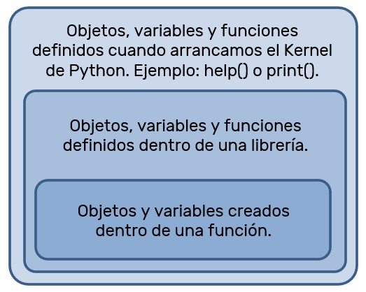

## Principales Objetivos de Aprendizaje para esta Clase

- Conocer el concepto de una Función
- Comprender el concepto de variables locales y globales
- Comprender el concepto de recursividad
- Conocer el concepto de parámetros y pasaje de parámetros

## Funciones

Las funciones son una secuencia de comandos que ejecutan una sección de código. En Python las funciones se definen usando la palabra reservada **def** y luego el nombre de la función con paréntesis y dos puntos que indican que lo que sigue son las sentencias, eventualmente una función debe retornar un valor, para esto se usa la palabra reservada **return**.

### Límites al declarar funciones

* Los nombres no pueden comenzar con dígitos
* No pueden utilizar una palabra reservada
* Las variables deben tener diferentes nombres
* Los nombres de las funciones deben ser descriptivas de lo que hacen las funciones "Imprimir_valor_variable"
* Los parámetros pueden tener valores por defecto.
* Puede devolver ningún, uno o más de un valor, y de diferentes tipos de datos.
* Se puede asignar a variables, el resultado de retorno de una función.

Para poder imprimir el valor de una variable dentro de un string podemos hacerlo así:

```python  
>>> def imprimir_valor_variable(var):
>>>     print('El valor de la variable es' + str(var))
```

Para devolver dos números ordenados de menor a mayor podemos hacerlo así:

```python
>>> def ordenar_dos_numeros(num1=0, num2=0):
>>>     if (num1 > num2):
>>>         return num2, num1
>>>     else:
>>>         return num1, num2
```

### Declarar y Ejecutar

Declarar una función es escribir su estructura y ejecutar una función es llamar la función y ejecutar su código, estas dos cosas ocurren en sentencias diferentes.

### Donde se puede acceder a las variables

Cada vez que una función se ejecuta se genera un contenedor donde las variables de la función van a vivir, una vez se sale de la función estas variables dejan de existir, esto se denomina espacio de nombres, alcance o scope de la función.
Dentro de una función puede haber una variable que solo se pueda utilizar dentro del cuerpo de la función, son **variables locales**. Mientras que las variables en el código desde el cual se llama a la función, son **variables globales**.



``` python
>>> def dividir(dividendo, divisor = 1):
>>>     if (divisor == 0):
>>>         return 'No se puede dividir por cero'
>>>     else:
>>>         return dividendo / divisor
>>> print(dividir(10))
10.0
>>> print(divisor)
---------------------------------------------------------------------------
NameError                                 Traceback (most recent call last)
~\AppData\Local\Temp/ipykernel_10044/1862935505.py in <module>
----> 1 print(divisor)

NameError: name 'divisor' is not defined
``` 

En este caso, 'divisor' es una variable local dentro de la función. Deja de existir cuando termina el llamado a la función, lo que denota el mensaje de error es que no encuentra esa variable para imprimir, porque de hecho, solo existió dentro del espacio de nombres de la función.

``` python
>>> divisor = 5
>>> def dividir(dividendo):
>>>     if (divisor == 0):
>>>         return 'No se puede dividir por cero'
>>>     else:
>>>         return dividendo / divisor
>>> print(dividir(10))
2.0
>>> print(divisor)
5
``` 

En este caso 'divisor' es una variable global. En el llamado de la función, como no encuentra una variable local llamada 'divisor', busca una variable global llamada 'divisor'. Desde dentro de la función, si se tiene acceso al espacio de nombres que la invoca.

``` python
>>> divisor = 5
>>> def dividir(dividendo, divisor = 1):
>>>     if (divisor == 0):
>>>         return 'No se puede dividir por cero'
>>>     else:
>>>         return dividendo / divisor
>>> print(dividir(10))
10.0
>>> print(divisor)
5
``` 

En este caso existe 'divisor' como variable global y 'divisor' como variable local. El llamado a la función usa siempre primero la variable local.

### Recursividad

En ocasiones, según la problemática que se quiera resolver, podemos utilizar la recursividad, que consiste en una función que hace referencia a sí misma. Python lo permite admitiendo el uso de las **llamadas recursivas**.
Entre las ventajas de usar funciones podemos encontrar que se obtiene código reutilizable y más prolijo o legible.
Es importante notar también que se puede documentar, mediante la inserción de comentarios y el uso de la función help().

``` python
>>> def factorial(numero):
>>>     '''
>>>     Devuelve el factorial
>>>     '''
>>>     if (numero > 1):
>>>         numero = numero * factorial(numero - 1)
>>>     return numero
>>> factorial(3)
6
>>> help(factorial)
Help on function factorial in module __main__:

factorial(numero)
    Devuelve el factorial
``` 

### Pasaje de parámetros por valor y referencia

En muchos lenguajes de programación existen los conceptos de paso por valor y por referencia que aplican a la hora de cómo trata una función a los parámetros que se le pasan como entrada. Su comportamiento es el siguiente:

Si usamos un parámetro pasado por **valor**, se creará una copia local de la variable, lo que implica que cualquier modificación sobre la misma no tendrá efecto sobre la original.
Con una variable pasada como **referencia**, se actuará directamente sobre la variable pasada, por lo que las modificaciones afectarán a la variable original.
En Python las cosas son un poco distintas, y el comportamiento estará definido por el tipo de variable con la que estamos tratando. 

Veamos un ejemplo de paso por valor.
``` python
>>> x = 10
>>> def funcion(entrada):
>>>     entrada = 0
>>> funcion(x)
>>> print(x)
10
``` 

Iniciamos la x a 10 y se la pasamos a funcion(). Dentro de la función hacemos que la variable valga 0. Dado que Python trata a los int como pasados por valor, dentro de la función se crea una copia local de x, por lo que la variable original no es modificada.

No pasa lo mismo si por ejemplo x es una lista como en el siguiente ejemplo. En este caso Python lo trata como si estuviera pasada por referencia, lo que hace que se modifique la variable original. La variable original x ha sido modificada.

``` python
>>> x = [10, 20, 30]
>>> def funcion(entrada):
>>>     entrada.append(40)
>>> 
>>> funcion(x)
>>> print(x)
[10, 20, 30, 40]
```

El ejemplo anterior nos podría llevar a pensar que si en vez de añadir un elemento a x, hacemos x=[], estaríamos destruyendo la lista original. Sin embargo esto no es cierto.

``` python
>>> x = [10, 20, 30]
>>> def funcion(entrada):
>>>     entrada = []
>>> funcion(x)
>>> print(x)
[10, 20, 30]
``` 

Una forma muy útil de saber lo que pasa por debajo de Python, es haciendo uso de la función id(). Esta función nos devuelve un identificador único para cada objeto. Volviendo al primer ejemplo podemos ver como los objetos a los que “apuntan” x y entrada son distintos.

``` python
>>> x = 10
>>> print(id(x))
4349704528
>>> def funcion(entrada):
>>>     entrada = 0
>>>     print(id(entrada))
>>> funcion(x)
4349704208
>>> print(x)
10
``` 

Sin embargo, si hacemos lo mismo cuando la variable de entrada es una lista, podemos ver que en este caso el objeto con el que se trabaja dentro de la función es el mismo que tenemos fuera.

``` python
>>> x = [10, 20, 30]
>>> print(id(x))
4422423560
>>> def funcion(entrada):
>>>     entrada.append(40)
>>>     print(id(entrada))
>>> funcion(x)
4422423560
>>> print(x)
[10, 20, 30, 40]
```

Entonces, en Python por defecto los valores simples se pasan por valor (int, float, string, bool, complex)

<hr width="75%">
  <p align="center">
  Es importante notar que cuando se hacen asignaciones entre variables, si no usamos el método copy(), lo que vamos a estar haciendo en realidad, es referenciar al mismo valor con dos variables distintas, pero esto ocurre sólo ante tipos de datos complejos. 
  </p>
<hr width="75%">

Sigamos el ejemplo:

```python
>>> # Se crea la variable x con el valor 1
>>> x = 1
>>> # Se asigna x a la variable y
>>> y = x
>>> # Se modifica la variable y asignándole el valor 2
>>> y = 2
>>> # ¿Qué valor ahora tienen ambas?
>>> print(x)
1
>>> print(y)
2
```

Vamos a hacer el mismo proceso, pero asignando una lista:

```python
>>> # Se crea la variable x con la lista [1,2]
>>> x = [1,2]
>>> # Se asigna x a la variable y
>>> y = x
>>> # Se modifica la variable y agregando un elemento
>>> y.append(3)
>>> # ¿Qué valores ahora tienen ambas?
>>> print(x)
[1,2,3]
>>> print(y)
[1,2,3]
```

Notar que ahora x e y referencian al mismo espacio de memoria, el cuál contiene la lista [1,2,3].<br>
Ahora se utiliza el método copy():

```python
>>> # Se crea la variable x con la lista [1,2]
>>> x = [1,2]
>>> # Se asigna x a la variable y
>>> y = x.copy()
>>> # Se modifica la variable y agregando un elemento
>>> y.append(3)
>>> # ¿Qué valores ahora tienen ambas?
>>> print(x)
[1,2]
>>> print(y)
[1,2,3]
```

Notar que ahora x e y referencian a espacios de memoria distintos.


En el ejemplo siguiente, pasamos una referencia a la taza y en nuestra función la llenamos de café. Al ser una referencia al objeto `cup`, vemos que se ve reflejado el cambio en ella (se llena de café) ya que son el __mismo__ objeto!.
En cambio, cuando pasamos algo por valor, estamos pasando el elemento por sí mismo, o una copia de él. En el ejemplo de la tasa, pasamos la tasa por valor, es decir que pasamos una tasa nueva, que existe por si misma (no es una referencia, si no la tasa misma). Por eso, cuando llenamos esa tasa de café, la otra se mantiene igual, ya que son dos _objetos distintos_.


### Funciones Lambda

La función Lambda es una forma conveniente de crear una función en una sola línea. También se las conoce como funciones anónimas, ya que no tienen nombre, sino que se asignan a una variable.

* Pueden tener cualquier cantidad de argumentos, pero solo una expresión.
* No necesitan un return.
* Muy cómodas para crear funciones rápido.

``` python
>>> lambda_producto = lambda x, y: x * y
>>> lambda_producto(3, 4)
12
``` 

* Si tienes dudas sobre este tema, puedes consultarlas en el canal **#m07_funciones** de Slack